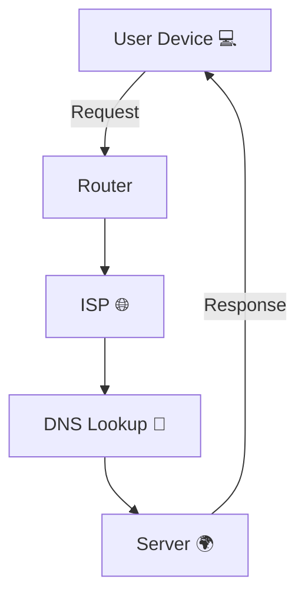

# 🌐 How Does the Internet Actually Work?

## 📖 Overview

- The **Internet** is a global system of interconnected **networks** 🌍.
    
- It enables devices to **communicate** and share information.
    
- Based on a set of rules called **protocols** → [[TCP/IP Protocol]].
    

## 💡 Key Concepts

- **Client-Server Model** → A client (your device) requests, and a server responds 📡.
    
- **Packets** → Data is broken into small chunks before transmission.
    
- **IP Address** → Unique identifier for every device on the network.
    
- **DNS (Domain Name System)** → Translates domain names (e.g., google.com) into IP addresses.
    
- **Routers & ISPs** → Guide packets through different networks until they reach the destination.
    
- **Protocols** → Rules of communication: [[HTTP]], [[HTTPS]], [[TCP]], [[IP]].
    

## 🔄 Workflow / Diagram

## 📌 Example

- When you type **www.google.com**:
    
    1. Request goes to **DNS** → finds Google’s IP.
        
    2. Packets travel through ISPs and routers.
        
    3. Google’s server sends back the webpage packets.
        
    4. Browser reassembles packets → Displays page ✨.
        

## 🔗 Related Notes

- [[TCP/IP Protocol]]
    
- [[HTTP vs HTTPS]]
    
- [[Domain Name System (DNS)]]
    
- [[Client-Server Model]]