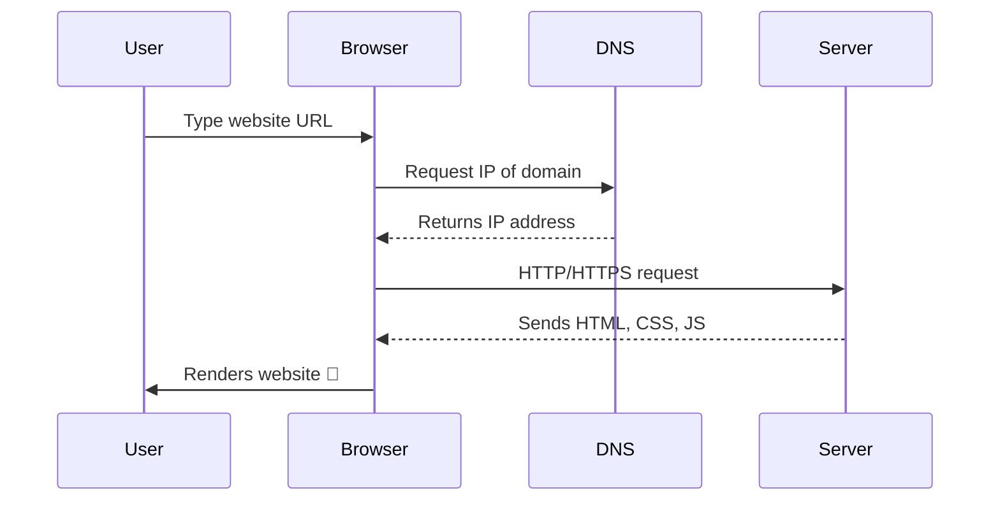

# 🌐 How Do Websites Actually Work?

## 📖 Overview

- A **website** is a collection of **web pages** accessible via the Internet.
    
- They are hosted on **servers** and displayed in browsers.
    
- Built using [[HTML]], [[CSS]], and [[JavaScript]].
    

## 💡 Key Concepts

- **Hosting** → Websites live on **web servers**.
    
- **Domain Name** → Human-readable name linked to IP via [[DNS]].
    
- **Frontend vs Backend**:
    
    - **Frontend** (Client-side): What users see → [[HTML]], [[CSS]], [[JavaScript]].
        
    - **Backend** (Server-side): Logic, databases, authentication → [[PHP]], [[Node.js]], [[Databases]].
        
- **HTTP/HTTPS** → Protocols for communication between browser and server.
    

## 🔄 Workflow / Diagram

## 📌 Example

- Typing **[www.github.com](http://www.github.com?utm_source=chatgpt.com)**:
    
    1. Browser asks **DNS** for GitHub’s IP.
        
    2. Connects to GitHub’s servers via **HTTPS**.
        
    3. Server sends back **HTML + CSS + JS**.
        
    4. Browser renders GitHub’s interface 💻.
        

## 🔗 Related Notes

- [[Frontend Development]]
    
- [[Backend Development]]
    
- [[Domain Name System (DNS)]]
    
- [[Web Hosting]]
    
- [[HTTP vs HTTPS]]