# 🎨 Introduction to Web Design

## 📖 Overview

**Web Design** encompasses the planning, conceptualizing, and arranging of content intended for the internet. It's a multidisciinary field that merges visual aesthetics ([[User Experience (UX) Design]]) with functionality and information architecture ([[User Experience (UX) Design]]).

Why it’s important 🚀

- **First Impressions:** A website is often the first point of contact. Good design builds credibility and trust.
    
- **Usability:** A well-designed site guides users to their goals without friction.
    
- **Conversion:** Good design directly impacts user engagement and business goals (e.g., sales, sign-ups).
    

## 💡 Key Components

- **Layout & Composition:** How elements are arranged. Key concepts include:
    
    - **Grid Systems:** Provide structure and consistency.
        
    - **Whitespace (Negative Space):** Gives elements room to breathe and reduces cognitive load.
        
    - **Visual Hierarchy:** Making important elements stand out. 
        
- **Colour:** Sets the mood, evokes emotion, and guides attention. [[Understanding Colour Theory]]
    
- **Typography:** The art of arranging text to be readable, legible, and visually appealing. [[Understanding Typography]]
    
- **Responsive Design:** Ensuring the website looks and functions well on all devices (desktops, tablets, phones) using techniques like [[Media Queries]] and flexible grids.
    

## 🔄 Design vs. Development

Web design and web development are two distinct but highly collaborative roles.

Code snippet

```mermaid
graph TD
    A[Design 🎨<br>Focus: Look & Feel] -- "Hands off" --> B[Development 💻<br>Focus: Functionality]
    
    subgraph "Design (UX/UI)"
        A1[User Research]
        A2[Wireframes & Prototypes]
        A3[Visual Design UI]
    end
    
    subgraph "Development (Frontend/Backend)"
        B1[HTML - Structure]
        B2[CSS - Styling]
        B3[JavaScript - Interactivity]
        B4[Server/Database]
    end

    A1 --> A2 --> A3 --> B
    B1 & B2 & B3 --> B4
```

