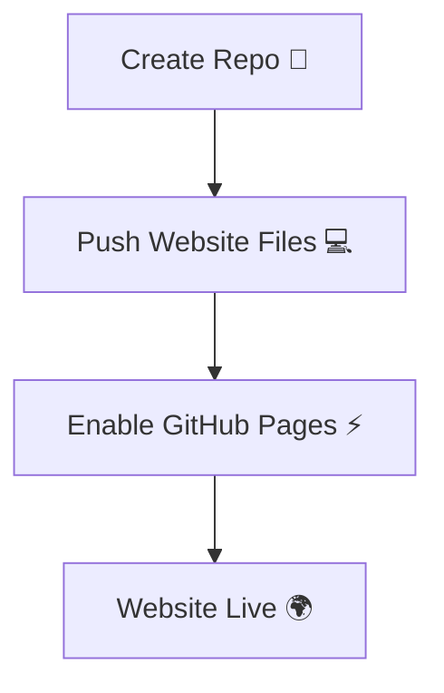

# 🌍 How to Host Your Website for Free with GitHub

## 📖 Overview

- **GitHub Pages** allows you to host static websites for free 🚀.
    
- Great for [[Frontend Development]], portfolios, and projects.
    

## 💡 Steps to Host

1. Create a **GitHub account**.
    
2. Create a new **repository** (name it `<username>.github.io` for direct hosting).
    
3. Upload your HTML, CSS, JS files.
    
4. Go to **Settings → Pages**.
    
5. Select the **branch** (usually `main`) and save.
    
6. Your site goes live at `https://username.github.io/`.
    

## 📌 Example Repo Structure

```bash
index.html
style.css
script.js
/images

```

## 🔄 Workflow / Diagram



## 🔗 Related Notes

- [[The HTML Boilerplate]]
    
- [[What are Webpages]]
    
- [[Frontend Development]]
    
- [[Git and GitHub Fundamentals]]