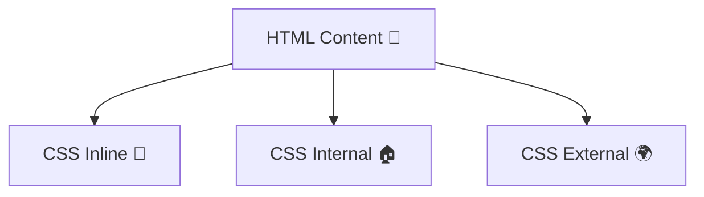

# 🎨 How to add CSS

## 📖 Overview

CSS can be applied to HTML in **three ways**.

## 💡 Methods

1. **Inline CSS** → Style written directly in the element.
    
    ```html
    <p style="color: red;">Hello World</p>
    ```
    
2. **Internal CSS** → Style written inside `<style>` in the HTML `<head>`.
    
    ```html
<head>
  <style>
    p { color: blue; }
  </style>
</head>
    ```
    
3. **External CSS** → Separate `.css` file linked using `<link>`.
    
    ```html
 <head>
  <link rel="stylesheet" href="style.css">
</head>
    ```
    

## 🔄 Workflow / Diagram



## 🔗 Related Notes

- [[Why do we need CSS]]
    
- [[CSS Selectors]]
    
- [[The HTML Boilerplate]]