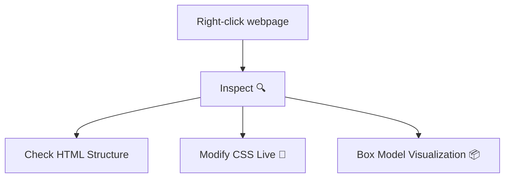

# 🕵️ Inspecting CSS

## 📖 Overview

- Browsers provide **Developer Tools** for inspecting and debugging CSS.
    
- Helps understand applied styles and fix layout/design issues.
    

## 💡 Key Features

- **Inspect Element** → Right-click → Inspect.
    
- View **HTML structure** and **CSS rules**.
    
- Modify CSS live to test changes.
    
- Check **box model** (margin, border, padding).
    
- Debug responsive design with **device mode** 📱.
    

## 📌 Example Workflow

## 🔗 Related Notes

- [[The CSS Box Model - Margin, Padding and Border]]
    
- [[CSS Colours]]
    
- [[Font Properties]]