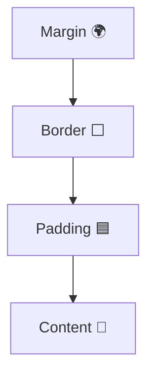

# 📦 The CSS Box Model - Margin, Padding and Border

## 📖 Overview

- Every HTML element is treated as a **box** in CSS.
    
- The **Box Model** defines spacing and layout.
    

## 💡 Components

1. **Content** → The actual text/image.
    
2. **Padding** → Space between content and border.
    
3. **Border** → Line around padding/content.
    
4. **Margin** → Space outside the border (separates elements).
    

## 📌 Example

```css
div {
  margin: 20px;
  padding: 15px;
  border: 2px solid black;
}
```
## 🎨 Diagram



## 🔗 Related Notes

- [[Inspecting CSS]]
    
- [[CSS Colours]]
    
- [[Font Properties]]