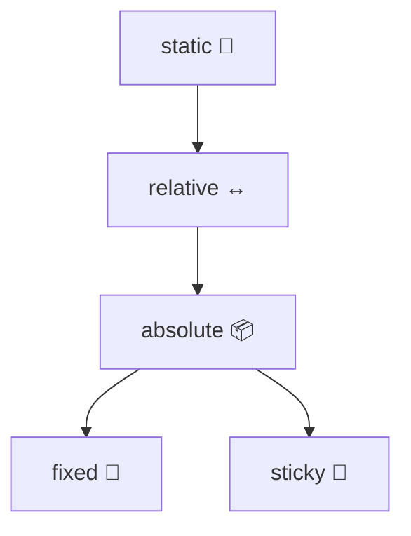

# 📍 CSS Positioning

## 📖 Overview

- CSS **positioning** controls how elements are placed in the layout.
    
- Works with the `position` property + coordinates (`top`, `left`, `right`, `bottom`).
    

## 💡 Position Values

- **static** → Default, normal document flow.
    
- **relative** → Positioned relative to its normal position.
    
- **absolute** → Positioned relative to nearest positioned ancestor.
    
- **fixed** → Stays in place even when page is scrolled.
    
- **sticky** → Switches between relative & fixed depending on scroll.
    

## 📌 Example

```css
.box1 {
  position: relative;
  top: 20px;
  left: 30px;
}

.box2 {
  position: absolute;
  top: 50px;
  right: 10px;
}

.navbar {
  position: fixed;
  top: 0;
  width: 100%;
}
```

## 🎨 Diagram



## 🔗 Related Notes

- [[Combining CSS Selectors]]
    
- [[The Cascade - Specificity and Inheritance]]
    
- [[The CSS Box Model - Margin, Padding and Border]]